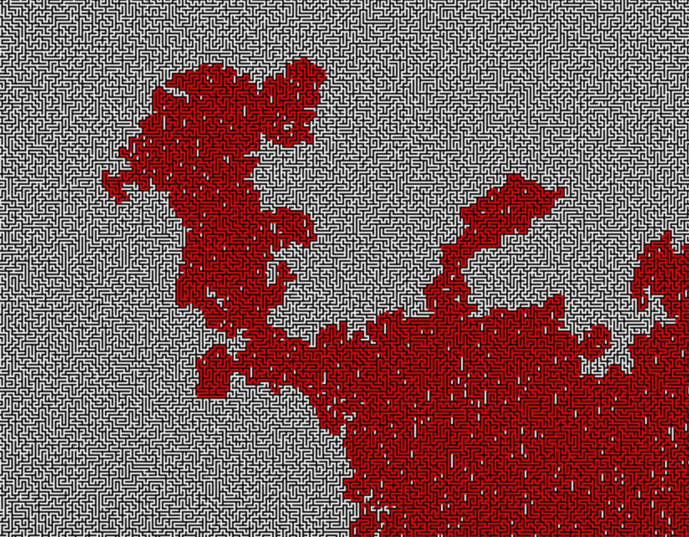

# thesus-rs
>__The sacrifices of the Athenians ended only when Theseus, son of Aegean ruler of Attica, traveled to Crete as part of
the youths to be sacrificed, but once in the labyrinth he killed the Minotaur and managed to find his way out of the
labyrinth with the aid of Ariadne, the daughter of Minos.__

```
████████╗██╗  ██╗███████╗███████╗██╗   ██╗███████╗      ██████╗ ███████╗
╚══██╔══╝██║  ██║██╔════╝██╔════╝██║   ██║██╔════╝      ██╔══██╗██╔════╝
   ██║   ███████║█████╗  ███████╗██║   ██║███████╗█████╗██████╔╝███████╗
   ██║   ██╔══██║██╔══╝  ╚════██║██║   ██║╚════██║╚════╝██╔══██╗╚════██║
   ██║   ██║  ██║███████╗███████║╚██████╔╝███████║      ██║  ██║███████║
   ╚═╝   ╚═╝  ╚═╝╚══════╝╚══════╝ ╚═════╝ ╚══════╝      ╚═╝  ╚═╝╚══════╝


⡏ loading image: ./mazes/perfect10k.png
⡗ analyzing maze
loading maze: ./mazes/perfect10k.png took: 8.122893689s
number of nodes loaded: 17915671
⢹ lets solve this bad boy...


███╗   ███╗ █████╗ ███████╗███████╗    ███████╗ ██████╗ ██╗    ██╗   ██╗███████╗██████╗
████╗ ████║██╔══██╗╚══███╔╝██╔════╝    ██╔════╝██╔═══██╗██║    ██║   ██║██╔════╝██╔══██╗
██╔████╔██║███████║  ███╔╝ █████╗      ███████╗██║   ██║██║    ██║   ██║█████╗  ██║  ██║
██║╚██╔╝██║██╔══██║ ███╔╝  ██╔══╝      ╚════██║██║   ██║██║    ╚██╗ ██╔╝██╔══╝  ██║  ██║
██║ ╚═╝ ██║██║  ██║███████╗███████╗    ███████║╚██████╔╝███████╗╚████╔╝ ███████╗██████╔╝
╚═╝     ╚═╝╚═╝  ╚═╝╚══════╝╚══════╝    ╚══════╝ ╚═════╝ ╚══════╝ ╚═══╝  ╚══════╝╚═════╝


finding the solution took: 5.812727798s
number of decisions: 10304076                                                                        
```

This is a small program that maps up labyrinths and then attempts to solve them using different algorithms.



## Algorithms
- Left Turn
- Dijkstra
- A-Star

### Tasks
- [x] Select algorithm from cmd
- [x] Select maze from cmd
- [x] Spinner when loading maze
- [x] Spinner when solving maze
- [ ] Print pretty statistics
- [x] Implement A*
- [ ] Implement Breadth first
- [ ] Implement Depth first
- [x] Select output filename
- [ ] Implement threaded loading of maze
